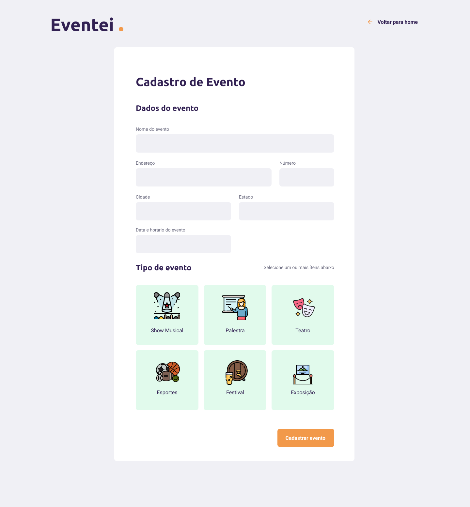
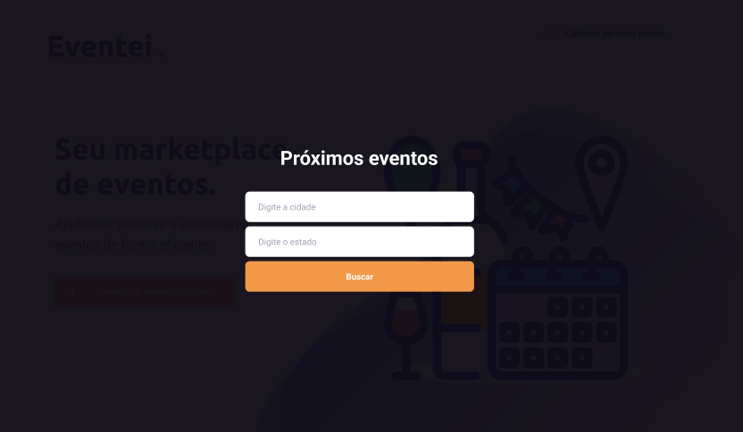
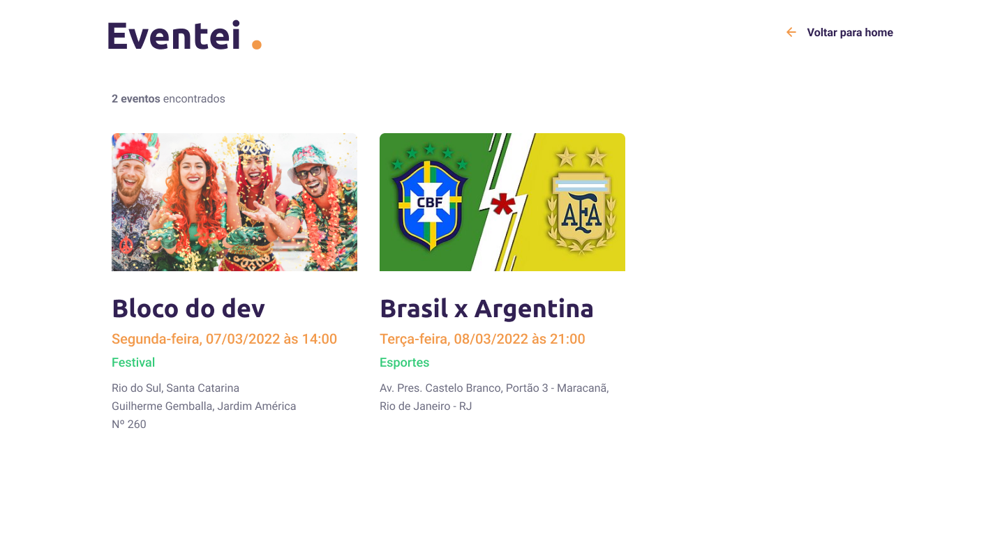

# EVENTEI .

<p>Cadastre, Busque e compre ingressos para seu evento favorito</p>

</p>


## Tópicos 

[Sobre o Foodfy](#sobre-o-eventei)

[Funcionalidades](#funcionalidades)

[Tecnologias e Ferramentas](#tecnologias-e-ferramentas)

[Instalação e uso](#instalação-e-uso)

[Licença](#licença)

<br>

## Sobre o Eventei

O Eventei foi um desafio da Mb Labs cuja a proposta era criar uma aplicação para gerenciar eventos ( Comprar e buscar eventos próximos ).

<h3 align="center">Homepage</h3>
<p align="center">
  
</p>

<br>


<h3 align="center">Pagina de criação de evento</h3>
<p align="center">
  
</p>

<br>

<h3 align="center">Modal de Busca de evento</h3>
<p align="center">
  
</p>

<h3 align="center">Resultados da Busca</h3>
<p align="center">
  
</p>

<br>

<br>

## Funcionalidades

- [X] Busque por eventos próximos a você.
- [X] Cadastre um novo evento publicamente.
- [X] Compre o ingresso para um evento.

<br>

## Tecnologias e Ferramentas

As seguintes tecnologias foram utilizadas no desenvolvimento do projeto:

- [HTML](https://devdocs.io/html/)
- [CSS](https://devdocs.io/css/)
- [JavaScript](https://devdocs.io/javascript/)
- [ReactJS](https://pt-br.reactjs.org/)
- [NodeJS](https://nodejs.org/en/)
- [Typescript](https://www.typescriptlang.org/)
- [MirageJS](https://miragejs.com/)
- [AXIOS](https://axios-http.com/ptbr/docs/intro)

<br>

## Instalação e Uso

Para rodar a aplicação, você precisa Seguir os passos abaixo:

```bash
# Abra um terminal e copie este repositório com o comando
$ git clone https://github.com/thiagoyellow/eventei.git
# ou use a opção de download.

# Entre na pasta com 
$ cd eventei

# Instale as dependências
$ npm install

# Rode a aplicação
$ npm start
```

**Importante:** Não exclua ou altere as imagens diretamente da pasta `public/assets`, pois as paginas compartilham desses arquivos entre si. 


<br>

## Licença
<a href="https://opensource.org/licenses/MIT">
    
</a>

<br>

Esse projeto está sob a licença MIT. Veja o arquivo [LICENSE](/LICENSE) para mais detalhes.

---

Feito com :purple_heart: by [THIAGO G SANTOS](https://github.com/thiagoyellow/)